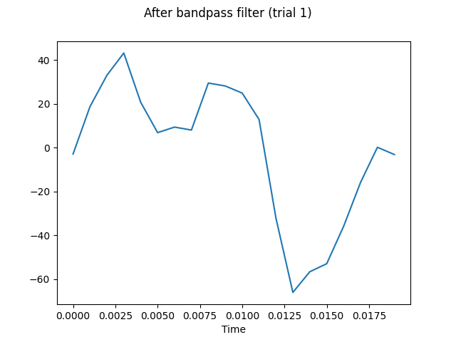

# EMG Signal Processing Pipeline

**pyemgpipeline** is an electromyography (EMG) signal processing pipeline package.

This package arranges the EMG processing steps together and into a standard order,
aiming at providing researchers in biomechanics, sports science, rehabilitation,
etc., with a convenient tool to work on EMG processing without doing it wrong.
The processing steps included in the package are
DC offset removal, bandpass filtering, full wave rectification, linear envelope,
end frame cutting, amplitude normalization, and segmentation.

## Scope

This package defines the processing pipeline for both surface EMG and
intramuscular EMG but not for high density EMG.
The EMG recording requires that the minimum sample rate be at least twice the
highest cutoff frequency of the bandpass filter based on the Nyquist theorem.

## Overview

**pyemgpipeline** contains modules `processors`, `wrappers`, and `plots`.

Module `processors` includes the base class `BaseProcessor` of all signal
processors and seven classes for different processing steps:
`DCOffsetRemover`, `BandpassFilter`, `FullWaveRectifier`, `LinearEnvelope`,
`EndFrameCutter`, `AmplitudeNormalizer`, and `Segmenter`.

Module `wrappers` includes three wrapper classes to facilitate the signal
processing by integrating data and individual processors.
Class `EMGMeasurement` works for data of a single trial,
class `EMGMeasurementCollection` works for data of multiple trials,
and class `DataProcessingManager` intents to fix the correct sequence of
processing steps so the users cannot do it wrong.

Module `plots` includes
the function `plot_emg` to plot EMG signals on `matplotlib` figures
and the class `EMGPlotParams` to manage the plot-related parameters.

## Documentation

The API reference is available here.
There are also [examples](https://github.com/aalhossary/pyemgpipeline/tree/master/examples) provided to demonstrate the usage of this package.

## Installation

**pyemgpipeline** can be installed from the PyPI repository:

```
pip install pyemgpipeline
```

It can also be installed from this repository:

```
pip install git+https://github.com/aalhossary/pyemgpipeline.git#egg=pyemgpipeline-tlwu-et-al-testxx
```

The dependencies of this package include `numpy`, `scipy`, and `matplotlib`.

## Quick Start

#### Data preparation

Prepare signal data of each trial as a 2d ndarray with shape
_(n_samples, n_channels)_,
where each column represents data of one channel.
If only one channel is presented, it can also be stored as
a 1d ndarray with shape _(n_samples,)_.

Prepare timestamp data of each trial as a 1d ndarray with shape
_(n_samples,)_.
If timestamp data is not provided, it will be generated by the
package, starting from 0 and in increments of _1/hz_,
where _hz_ is the sample rate.

Data of multiple trials are organized in a _dict_ or a _list_.

#### Demo code

```
>>> import numpy as np
>>> import pyemgpipeline as pep
>>> all_data = [  # two trials in a list  # one channel in each trial
...     np.array([20.3, 41.0, 53.9, 63.3, 39.5, 24.9, 26.1, 24.0, 44.1, 42.0,
...               37.4, 24.6, -21.8, -56.3, -48.1, -45.0, -29.1, -9.6, 5.3, 1.4]),
...     np.array([1.1, 2.9, 1.4, -0.2, 4.4, 7.2, 9.9, 19.1, 14.2, 18.8,
...               17.2, 17.9, 11.1, 13.9, 15.4, 19.4, 12.1, 16.9, 12.4, 9.0])
... ]
>>> hz = 1000
>>> mgr = pep.wrappers.DataProcessingManager()
>>> mgr.set_data_and_params(all_data, hz=hz, all_main_titles=['trial 1', 'trial 2'])
>>> mgr.set_end_frame_cutter(pep.processors.EndFrameCutter(n_end_frames=0))
>>> c = mgr.process_all(is_plot_processing_chain=True)
```

#### Results

Intermediate results during the whole processing steps can be visualized in figures.
For example, the figure below shows the result of trial 1 after the bandpass filter
step is done.



The final processed signals are stored in `c.all_data`.

## Community Guidelines

For contribution, please clone the repository, make changes, and create a pull request.

For reporting any issues, please use
[github issues](https://github.com/aalhossary/pyemgpipeline/issues).

For support, please contact the authors via their emails
or [github issues](https://github.com/aalhossary/pyemgpipeline/issues).

## Citation

If you use this package in your project, please cite this work.


